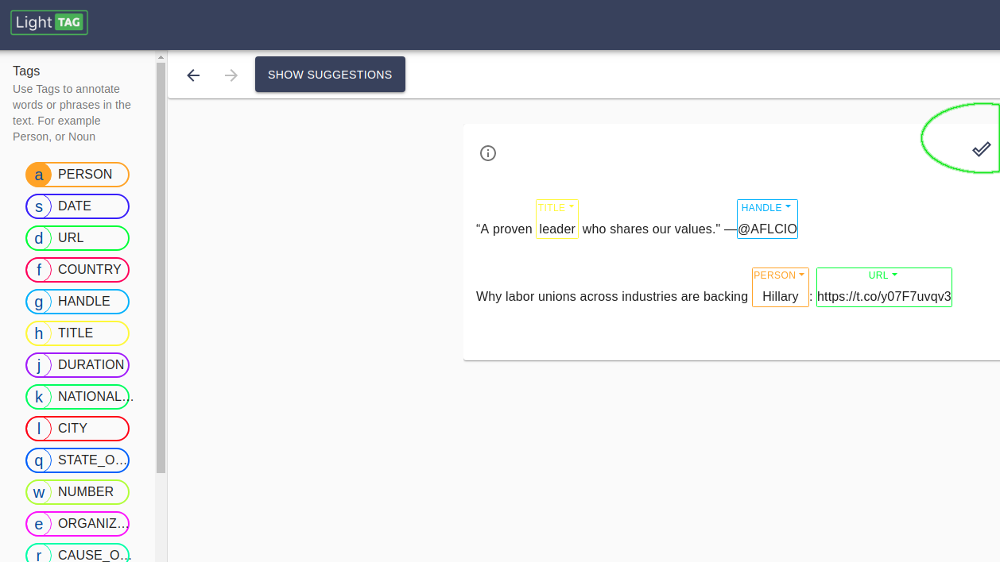
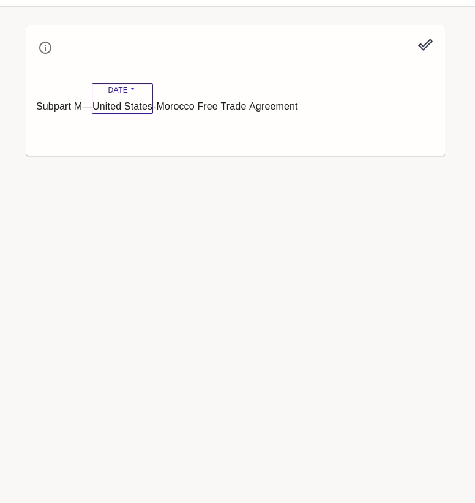
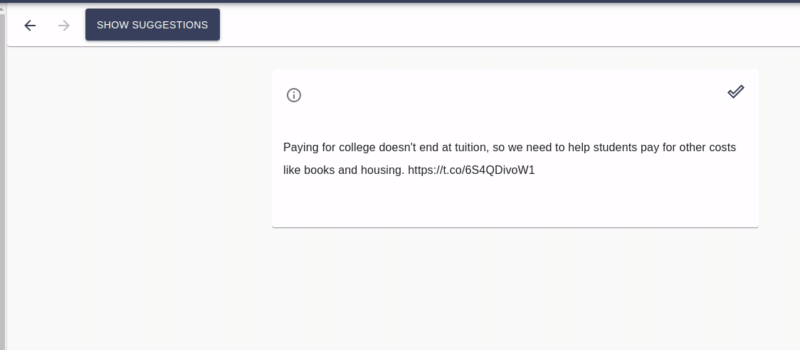

Annotating
==========

This section introduces the annotation view, where you'll be annotating data. This page describes what you'll be seeing and how to to navigate it. 
The subsections describe the different kinds of annotations you can make and you to do so efficiently 

As an annotator you'll see something like this: 

- Depending on how the project manager configured your work, it may look slightly different. 
- The Highlighted Checkmark on the right will submit your work and bring the next task to work on 
- In the center, you'll see the example you are annotating and any annotations you've applied
- If available, the "Suggestions" button will be blue indicating LightTag has suggestions for you 
- The list of Tags on the left indicates the tags you can use. The letter in each avatar indicates a keyboard shortcut

Examples
-----------

In the center of the screen you'll see one or more Examples to be annotated. 

Concepts Sidebar
----------------

The Concept Sidebar will show the list of Tags (for span annotation) and or Classes (for Classification) that you can use 

Guidelines
-------------
The Guidelines button on the top right  will show you guidelines your manager provided if they have 

Submitting Work
----------------

Single Example
~~~~~~~~~~~~~~

In Single Example mode, where there is one example displayed at a time, clicking the checkmark on the example will submit your work and 
bring you to the next task 

Multi Example Mode
~~~~~~~~~~~~~~~~~~

In Multi Example mode, each checkmark is a commitment that you've evaluated that example. Once you've committed to all examples, the Submit All 
button will be active on the top left. 

.. figure:: ./img/multiExamples.gif

Navigating Previous Tasks
-------------------------

You can go back and adjust your work by using the arrows on the top left 

Changing A Tag that was Applied 
--------------------------------
You can change an applied tag by clicking on the header and selecting a different option 

Using Suggestions 
------------------
When available you can use LightTag provided suggestions to work faster 

