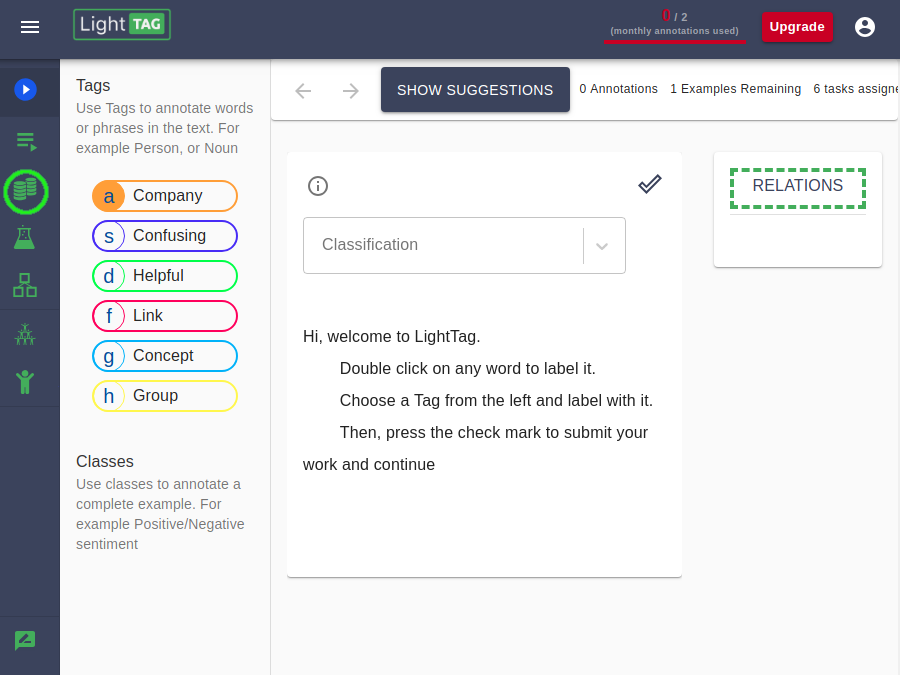
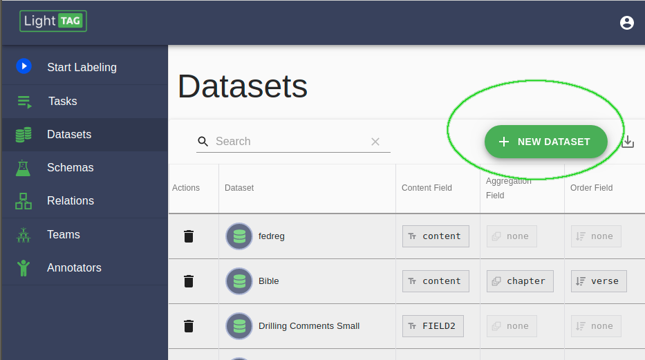
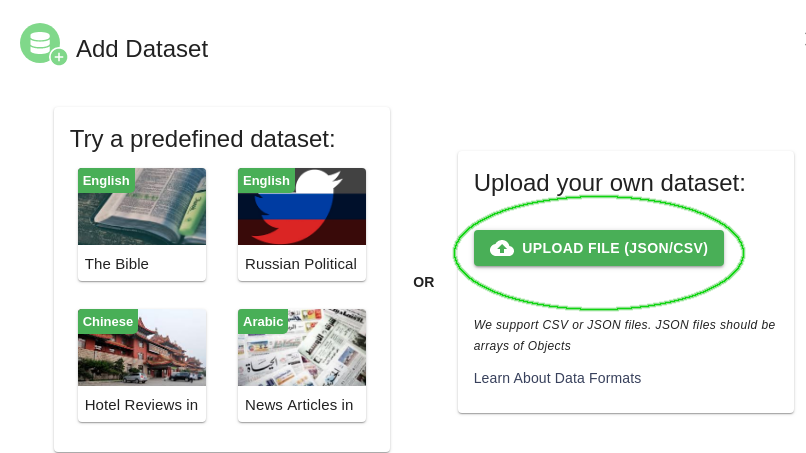
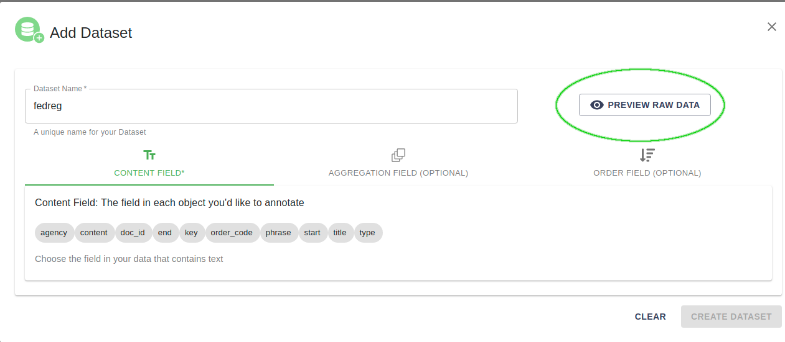
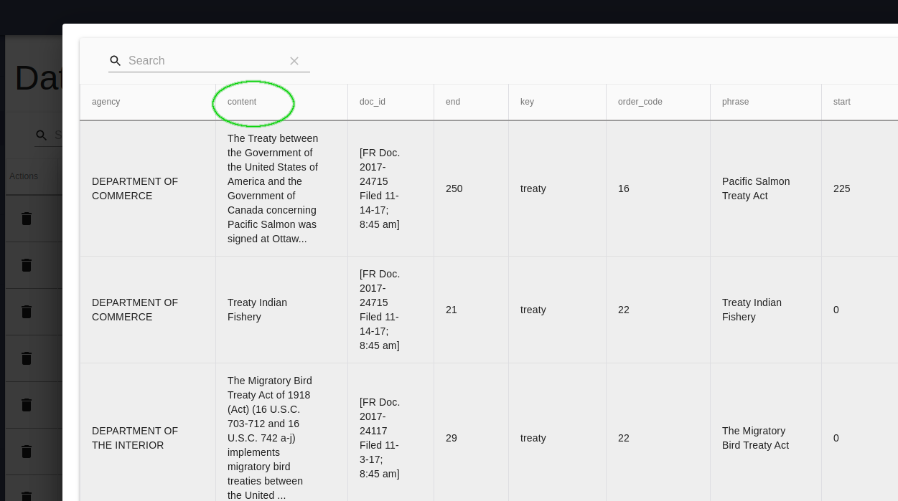
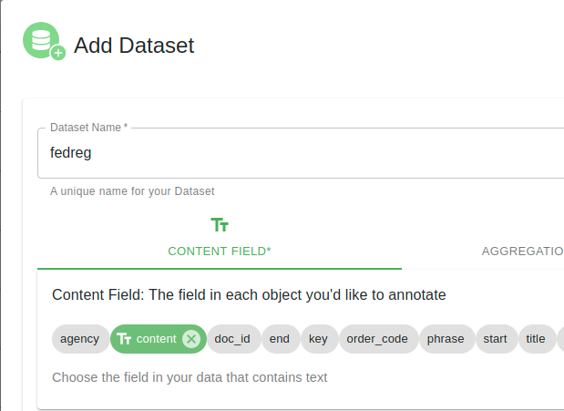

.. _upload-dataset-quick:

Upload a Dataset with the Management Console
---------------------------------------------

Go to the Dataset View
~~~~~~~~~~~~~~~~~~~~~~

Click + New Dataset
~~~~~~~~~~~~~~~~~~~

Click Upload File (JSON/CSV)
~~~~~~~~~~~~~~~~~~~~~~~~~~~~
.. tip:: You'll need to have your dataset ready as either a CSV or a JSON.
    If using JSON, the data should be a JSON array of objects. See :ref:`here<data_prep>` for examples.

Give Your Dataset A Unique Name
~~~~~~~~~~~~~~~~~~~~~~~~~~~~~~~

LightTag will choose a name based on the file you uploaded.

Preview Your Data
~~~~~~~~~~~~~~~~~~~~

Click on the preview dataset button. LightTag will show you the data you uploaded in a Table. Take a look, make sure everything is as you expected. 

   LightTag displays the contents of your dataset. Find the field (column) that had the text you want to label 

Select The Content Field
~~~~~~~~~~~~~~~~~~~~~~~~
Exit the preview page and return to the dataset upload dialog. LightTag will show you the availble fields. Choose the field with the text
you want to annotate. That's the **Content Field**

Press Create Dataset
~~~~~~~~~~~~~~~~~~~~
That's It

