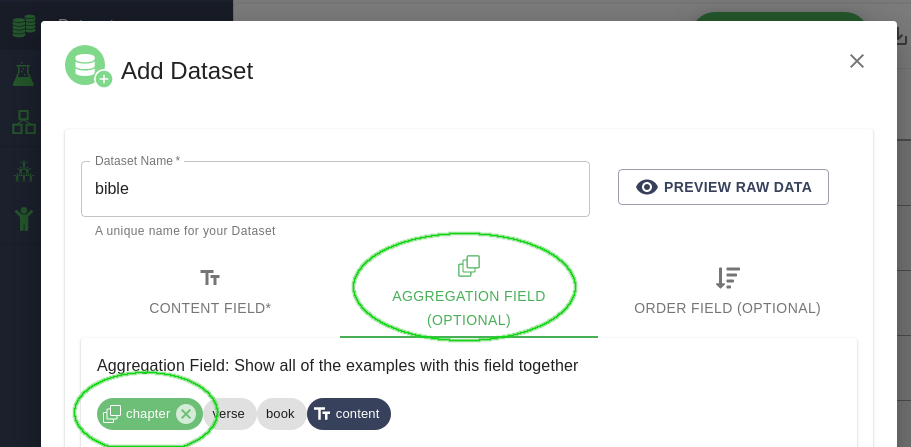
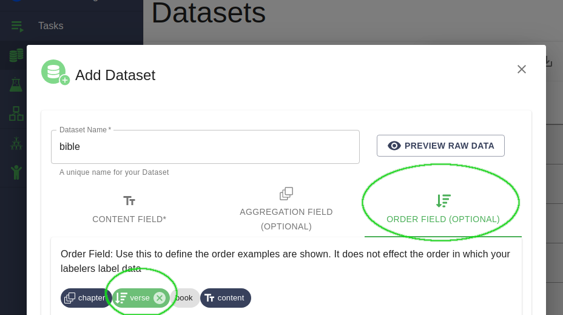

.. _contextual-display:

Configuring Contextual Display - Showing Examples Together and in Order
========================================================================

.. figure:: ./img/multiExamples.gif
  :width: 600
  :alt: Multiple examples
  :align: center

Sometimes you'll want to show multiple examples at the same time so that your annotators can have context. 

.. admonition:: Use Case - Annotating Long Documents

    One common use case is during the annotation of long documents. You might find it convenient to split your documents into 
    paragraphs or setences, but you still want annotators to see the context of the entire document in order. 

.. admonition:: Use Case - Dialog Data

    Another common use case is during the annotation of dialog data. You'll typically be annotating each utterance in a dialog 
    seperatly, but want your annotators to see the entire context of the conversation.

LightTag supports Contextual Display of data. When you upload a :ref:`dataset<dataset>` each example has a field with the text to be 
annotated as well as any additional **metadata** attached to an example. You can use this metadata to specify which examples should be
shown together, and in what order. 

Showing Multiple Examples Together - The Aggregation Field
~~~~~~~~~~~~~~~~~~~~~~~~~~~~~~~~~~~~~~~~~~~~~~~~~~~~~~~~~~

To configure LightTag to show multiple examples together, we'll tell it to *aggregate* examples according to a field in the metadata. 

In the example below, we've uploaded data from the Bible that has been split into verses. We'll configure LightTag to display all verses 
from the same chapter together

   
   In the Dataset dialog choose the aggregation field tab and then select the field you'd like to aggregate by 

Setting Display Order - The Order Field
~~~~~~~~~~~~~~~~~~~~~~~~~~~~~~~~~~~~~~~~

Usually when we aggregate examples we'll want to specify the order each example in a group appears. In the dialog example we'll order
the messages in a conversation by timestamp, in the long articles examples we'd order the examples by paragraph number. In our bible example,
we'll order the examples by verse.

   In the Dataset dialog choose the order field tab and then select the field you'd like to order by 