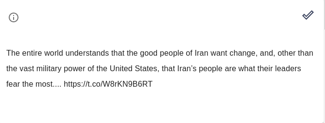

.. _example:

What Data Looks like
====================

In LightTag, an example is a single unit to be annotated. An example could be a tweet, a message in a conversation,
an abstract from a paper or an entire document.
An example is an isolated unit of annotation, that is an annotation can not span multiple examples, rather a
single annotation must be contained in one example.

In the annotation UI a single example would like this:

If you've defined :ref:`Contextual Display<contextual-display>` so that multiple examples are shown together, it would look like this: 

.. figure:: ./img/multiExamples.gif
  :width: 600
  :alt: Multiple examples
  :align: center

Example Metadata
-----------------

Text data doesn't live in isolation, and often we have additional fields of text that we'd like to keep for further
analysis as well as display to our annotator to provide more context.

For example, you'd like to show the speaker name when annotating a conversation, or the publication name when annotating
an article.

As described in the :ref:`data_prep` section, you'll upload an individual example as a JSON object, which allows you to
upload arbitrary data in essentially arbitrary shapes. LightTag will

1. Store this metadata alongside your example
2. Display it to your annotator
3. Return it to you when you retrieve annotations (to spare you a join)

