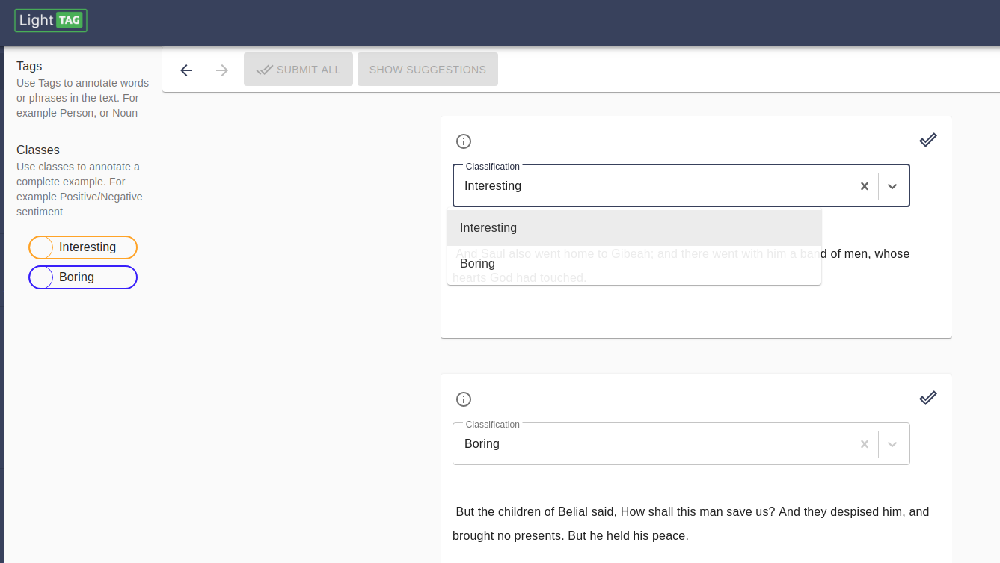

.. _classes:
Classes
=======
Classes are used to classify a document. If your schema contains classes then annotators will be able to select them 
at the top of each example. 

You can configure your schema to allow multiple schemas, then your annotators can select multiple classes per each example. 

.. tip:: Give Your Annotators an Unknown option
   
   When classifying, annotators can leave the classification field empty which is useful when the document is not relevant. 
   Sometimes, an example is confusing, in which case it is useful to have one or more classes that indicate that. 

