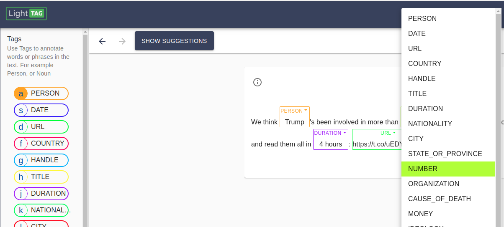

.. _tag:

Tags
-------

Tags are used to annotate a span in the text with a particular concept. When a span is applied, 
the annotated text will have a colored border indicating the applied tag, as well as it's name 
above it. 

The list of available tags is always displayed to the annotator on the left hand side. 

Clicking on the name of a tag in an applied annotation will open a context menu, allowing the annotator to change the tag. 

How can use as many tags as you need, the only requirement is that they have distinct names. 
