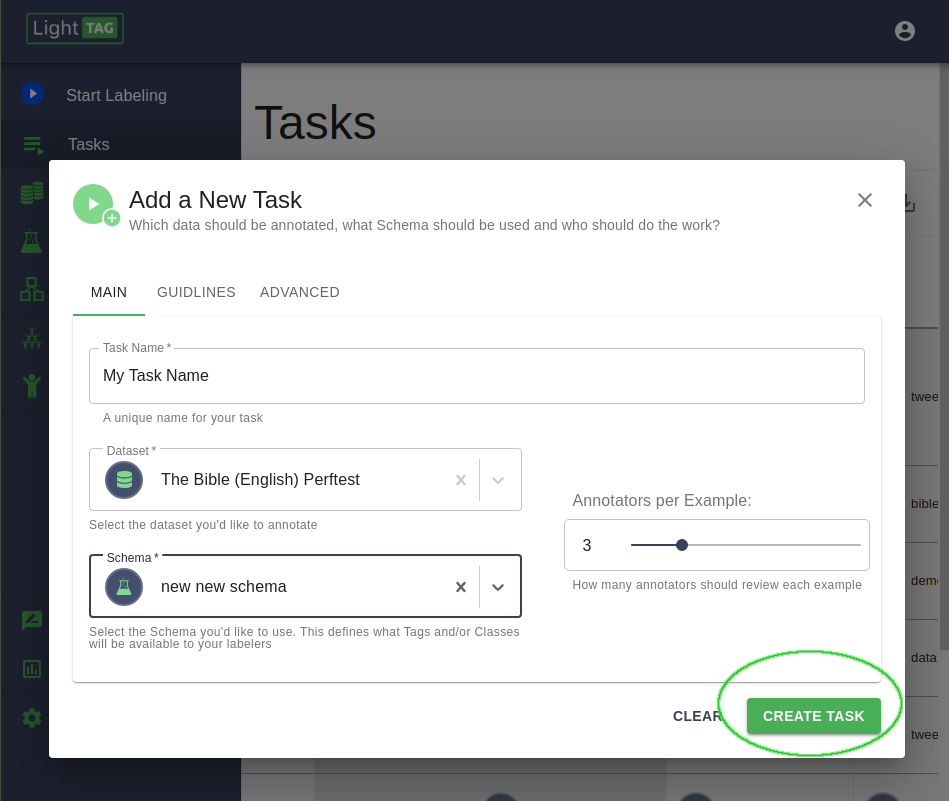
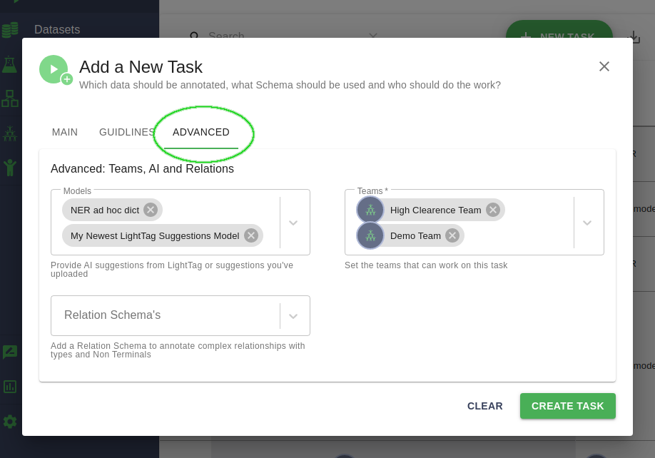
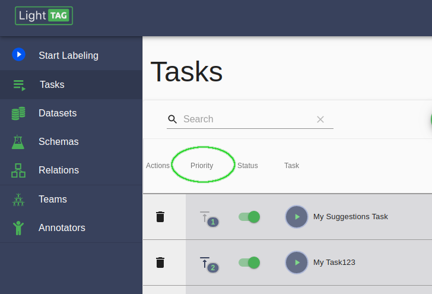

.. _taskdefinition:

Task Definition
================

LightTag manages a prioritized queue of work for your annotators to work on. Whenever they log in to the system, LightTag looks at the 
queue of work and assigns the annotator the highest priority work that needs to be done. 

When you add a new Task Definition, it goes to the bottom of the priority queue by default, though you'll be prompted to make it top priority. 

Basic Configuration
-------------------
Task Definitions are the definitions of work that needs to be done. At a minimum, a task definition specifies a :ref:`Dataset<dataset>` and 
a :ref:`Schema<schema>` and how many annotators should annotate each example. 

   
The kinds of annotations that will be done in the task are defined by the Schema (e.g. Tags, Classification, Multi Class Classification) 

Annotators Per Example - How many people should label each example
~~~~~~~~~~~~~~~~~~~~~~~~~~~~~~~~~~~~~~~~~~~~~~~~~~~~~~~~~~~~~~~~~~~
.. tip:: 
      
      Remember: 💩 Data in => 💩 Models out

      Annotation projects are an exercise in resource management and trade offs. You'll need to balance your teams throughput (number of annotations) 
      with your ability to control for annotation quality. 

      We strongly recomend starting an annotation project with at least 2 annotators annotating each example. This will let help you confirm that
      your team understands your goals and guidelines and that you've covered edge cases that might arise in the data. 

      You can use LightTag's :ref:`analytics<analytics>` to quickly see the level of agreement between annotators and review individual annotations 
      to measure the quality of your data. Doing this early on will give you confidence in your team and pave the way for single annotator work 
      with consistent quality. 

Task Guidelines - Instructions to show your annotators
---------------------------------------------------------

Advanced Configuration
----------------------
Task Definitions can also specify one or more :ref:`Teams<team>` that will be working on the task. By default, this will be Everyone
and you can specify teams based on your own logic such as language proficiency, access controls or domain expertise. 

     

Teams - Who Will Label The Data
~~~~~~~~~~~~~~~~~~~~~~~~~~~~~~~~
If you'd like to restrict the annotators who will be working on this task, change the teams assigned to it. 
By default, LightTag assigns the *Everyone* team, which means everyone will work on this task. 

Models - Displaying Suggestions / Pre-Annotations
~~~~~~~~~~~~~~~~~~~~~~~~~~~~~~~~~~~~~~~~~~~~~~~~~~~

Suggestions are a great way to help your team work faster, at the risk of biasing your data towards the suggestions. 

You can upload your own :ref:`Suggestions<suggestions>` or choose to use LightTag's built in Model, which will learn from your team 
as you annotate. 

Task Definition Priorities
---------------------------

Task Definitions are prioritized, and this priority decides which task will be worked on. When you add a new task, you will be prompted
to make it top priority and start working on it immediately. Otherwise, it will be at the bottom of the queue. 

You can always raise the priority of a Task by clicking on the priority button  in the task view, shown below. 

How Work is Assigned
~~~~~~~~~~~~~~~~~~~~
When an annotator logs into the system and whenever they submit work, they will be assigned the next task to work on. 
A simplified explanation of the assignment process follows: 

1. Find the highest priority task that is assigned to a team this annotator belongs to 
2. Check if this annotator has any work left to do in the task definition 
3. If yes, then assign the work item that is closest to being completed (e.g. 2 out of 3 annotators have already assigned this) 

.. note::

   LightTag gauntness "at least once" work assignment, as opposed to exactly once. 
   This means that in rare occurrences you might see one more annotator working on a single example than was assigned. 

