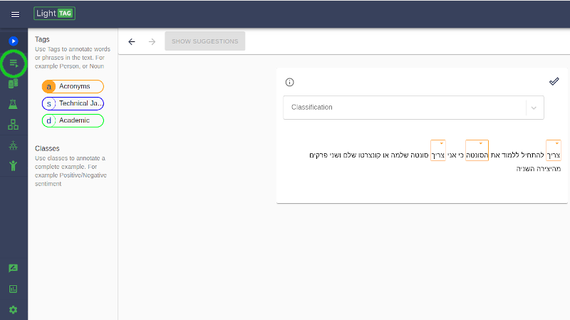
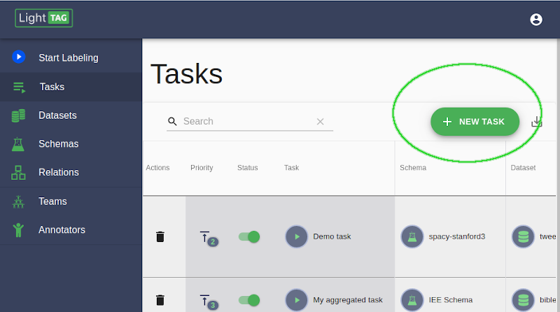
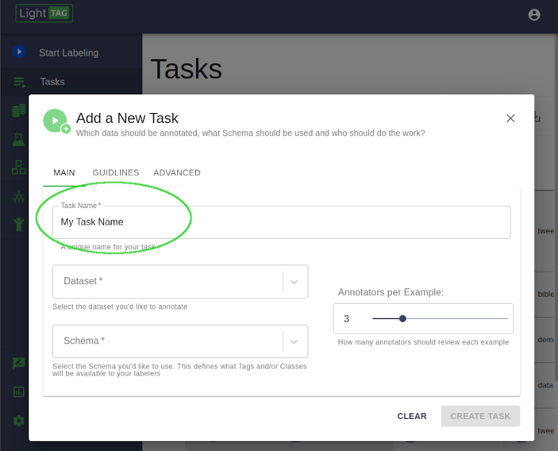
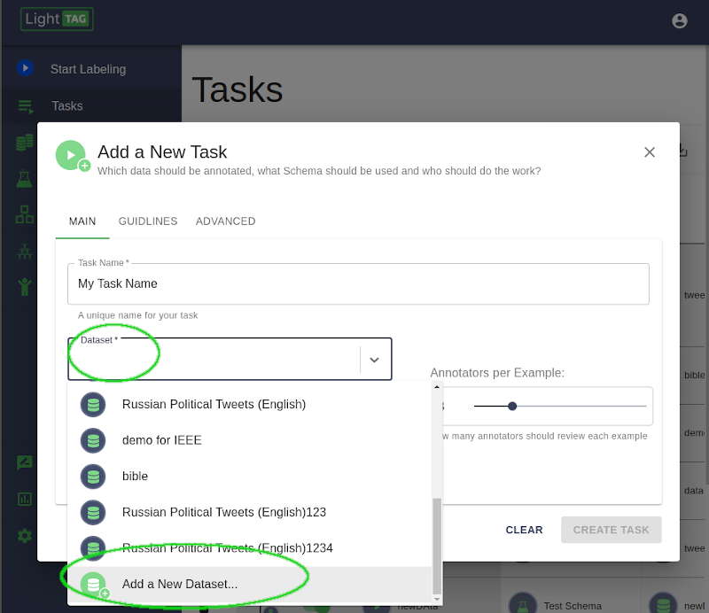
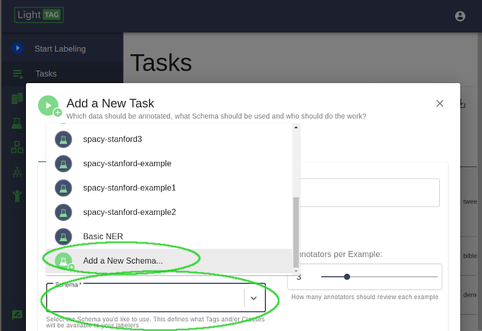
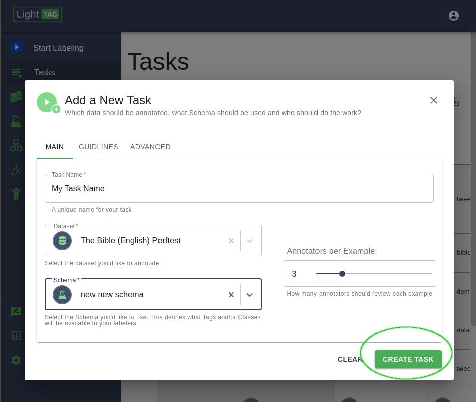
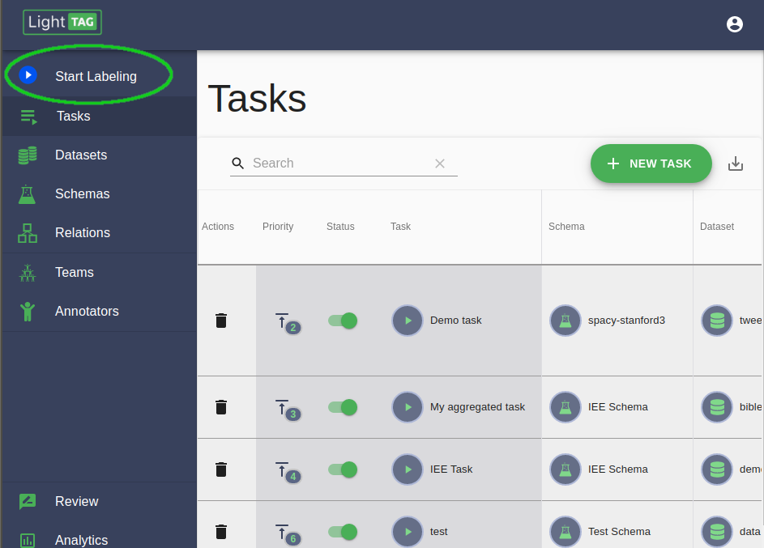

.. _very-quick-start:

Quick start
=================

We're Going to set up a basic annotation project in LightTag. You should already have the data 
you want to label, and the :ref:`Schema<schema>` (the tags and classes you want to use). If you don't,
LightTag has some baked in so you can follow along. Just follow these steps. 

1. Go to The Tasks Section of the Management Console
~~~~~~~~~~~~~~~~~~~~~~~~~~~~~~~~~~~~~~~~~~~~~~~~~~~~~

The Management Console is always available to a manager user. If your the first user in your workspace you are the manager, 
otherwise ask the manager to promote you. 

   
   Open the Task section of the LightTag Management console. That's the first green button on the left

2. Click Add New Task
~~~~~~~~~~~~~~~~~~~~~~~

LightTag manages the work you and your team will be doing. You need to define that work which is what we'll do here

   
   Click the Add New Task Button on the top right

3. Give Your Task a name
~~~~~~~~~~~~~~~~~~~~~

Each task in LightTag must have a unique name. Be descriptive, it will help you keep track of what you are doing.

   
   Give your task a unique name. Be descriptive. 

4. Upload a Dataset 
~~~~~~~~~~~~~~~~~~~~

You'll have to upload data to label it. LightTag stores collections of data in a :ref:`Dataset<dataset>` which you will upload
and configure now. 

   Upload a new dataset or select one you've already defined. Read about data formats :ref:`here<data_prep>`. 
   See the :ref:`Dataset<dataset>` section for advanced features. 

5. Define A Schema
~~~~~~~~~~~~~~~~~~~~

Schemas contain the concepts you will be annotating with. 

   Select an existing Schema or define a new one. See the :ref:`Schemas:<schema>` section for schema configuration options

6. Create The Task
~~~~~~~~~~~~~~~~~~~~
Now that we have a dataset and schema defined, let's save it to the server. 

   
   Press the Create Task button. 

7. Label Data
~~~~~~~~~~~~~~
Press the Label Data button to start labeling. 

    
   Press the Start Labeling Button to start working on your task

