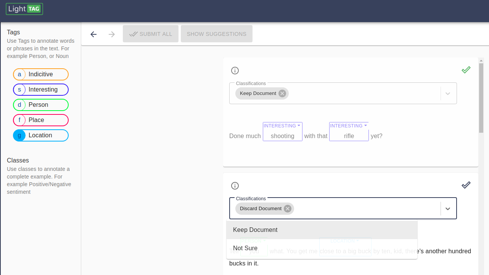
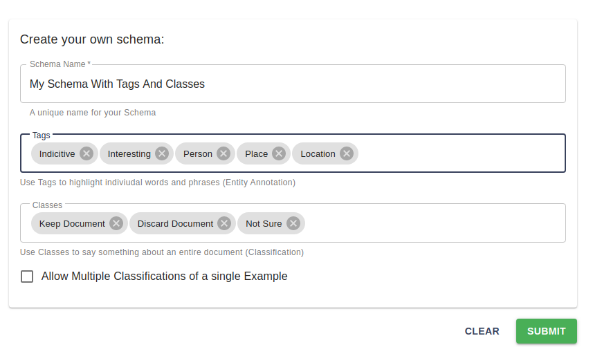

Annotate Entities and Classify Examples at the Same Time
=========================================================

To annotate  spans and classify examples in the same task, create a :ref:`Schema<schema>` with both tags and classes. 

