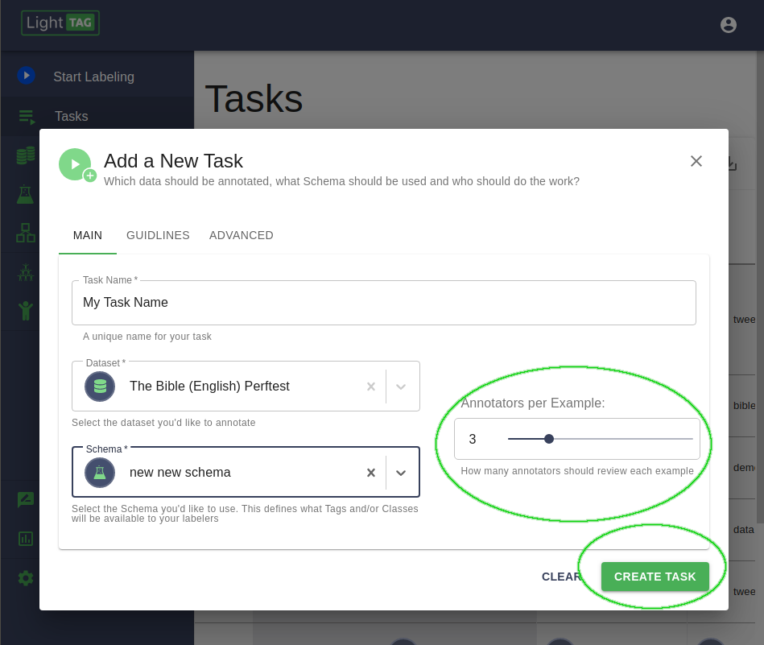

Have More Than One Person Label Each Example
==============================================
To have more than one annotator label each example, so that you can measure inter annotator agreement, 
simply configure your :ref:`Task Definition<taskdefinition>` to have as many annotators per example as you'd like.  

Don't forget, LightTag calculates Inter Annotator Agreement for you in the :ref:`Analytics<analytics>` section 

.. figure:: ./img/iaa.png