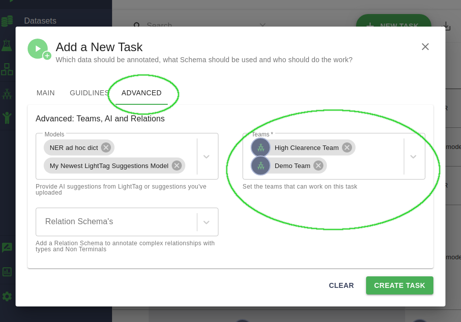

Route Different Work To Different Teams
========================================
By default LightTag will route work to all of your annotators. If you'd like
to route work to a particular subset, first define a :ref:`Team<team>`. 
Then, create a new :ref:`Task Definition<taskdefinition>` and set the team you want
in the advanced section

   