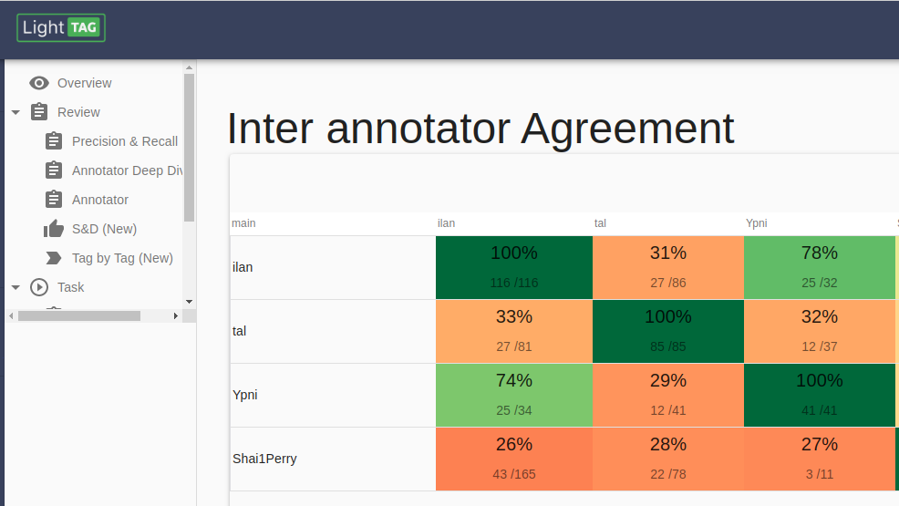

.. _frequency:

Frequency Metrics
==================

Frequency Metrics are metrics we can derive by counting, without additional Review from you. 
These include Inter Annotator / Inter Model agreement and Tag/Class Frequency. 

Inter Annotator/Model Agreement 
-------------------------------

Inter Annotator Agreement is good way to see that your annotators are labeling consistently. 
By itself, it won't tell you if your data is good, but it will tell you if your labelers are labeling in the same way. 
Consistently low IAA value are indicative of ambiguous guidelines. 

Reading The IAA Table
~~~~~~~~~~~~~~~~~~~~~~

IAA tables are not symetric, as opposed to confusion matrices which data scientists typically use to evaluate models. 
It's important to remember this and understand why: Said simply, if I labeled ["Dog","Cat"] and you labeled ["Cat"] then 
- I agreed with 100% of your annotations
- You agreed with 50% of my annotations. 

Moreover, different pairs of annotators will have observed different examples together depending on how your task was configured. 
LightTag's IAA table accounts for this, the main number in each cell is the percent agreement. 
The two numbers below indicate (The number of annotations where C agreed with R) divided by 
(The number of annotations that R made and C could have made) where R is the row and C is the column. 

Annotators
~~~~~~~~~~
IAA tables are available for annotators and for models. 
When viewing IAA data for annotators, you'll need to select a particular task from the filters menu on the right. 
This is because it only makes sense to compare annotator agreement between annotators working on the same task. 

Models
~~~~~~~
Remember that Models in LightTag live under a Schema. To see agreement for all models in a Schema choose that schema from the filters section. 
To narrow it down to a particular dataset choose that dataset from the filters. 

