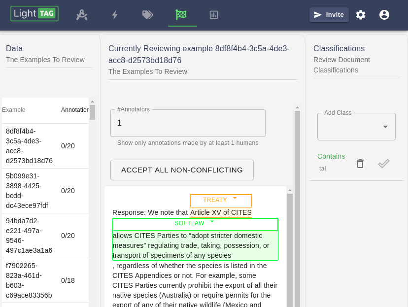
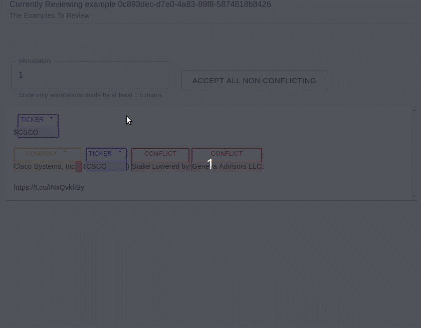
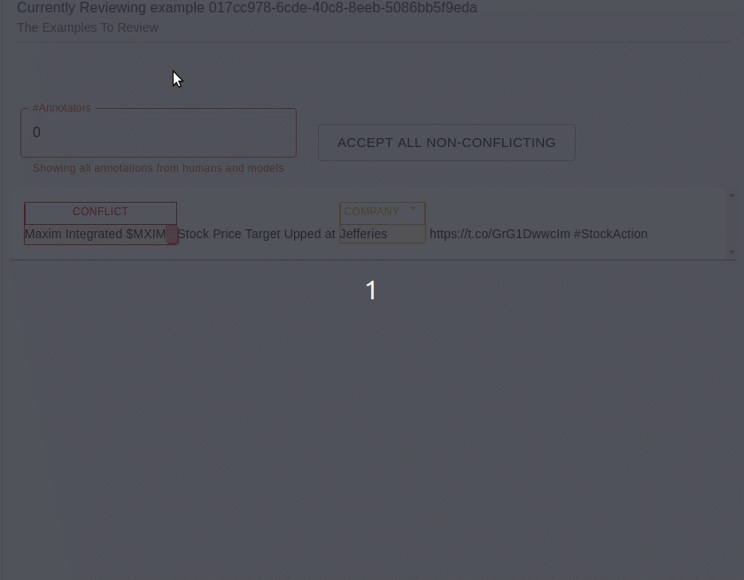
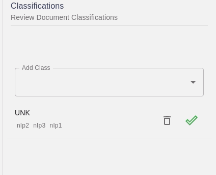

.. _how-to-review:

How To Review
======================

The Layout
-----------


The main Review Page is divided into three sections

* The Data Section provides a Sortable list of all items that need review in the dataset
* The Example section shows the current Example being reviewed and any annotations made to it
* The Classification section displays any classifications applied to the current example

What Happens To Data When I Review It
-------------------------------------
During the course of review, LightTag will mark a particular annotation or classification as reviewed
and whether it was reviewed as correct or not. When you download the results, you will be given all of the data, with the same indication.

If you add or modify an annotation during review, it will automatically be marked as correct.


Review Span Annotations
------------------------
Reviewing annotations is much like standard annotation. You can add and modify annotations as usual.
Additionally, when you hover over an annotation, you can accept or reject it



Clicking on an annotation will show you who made it.

Dealing With Conflicts
``````````````````````
Sometimes your annotators will disagree on the proper tag for an annotation or it's exact boundaries.
In such cases, LightTag will show the span in red with the header **Conflict**.
Clicking on a conflict will open the conflict box where you can set the correct annotation

Automatically Accept Non Conflicting Annotations
`````````````````````````````````````````````````
When working with multiple annotators, it is convenient to accept all annotations that had some level of agreement.
You can do so with LightTag by toggling the #Annotators displayed and clicking "Accept All Non Conflicting".
This will accept all annotations with X or more annotators.

You can then go back to resolve any remaining conflicts



Showing Annotations From AI Models as well as Humans
````````````````````````````````````````````````````
Setting the #Annotators to 0 will display annotations from any models alongside human annotations.


Reviewing Classifications
--------------------------
The right hand side of the screen will display any classifications made as well as who made them.
To accept or reject a classification click the check mark or trash can.
To add a classification (and implicitly reject others) choose it from the drop down.

