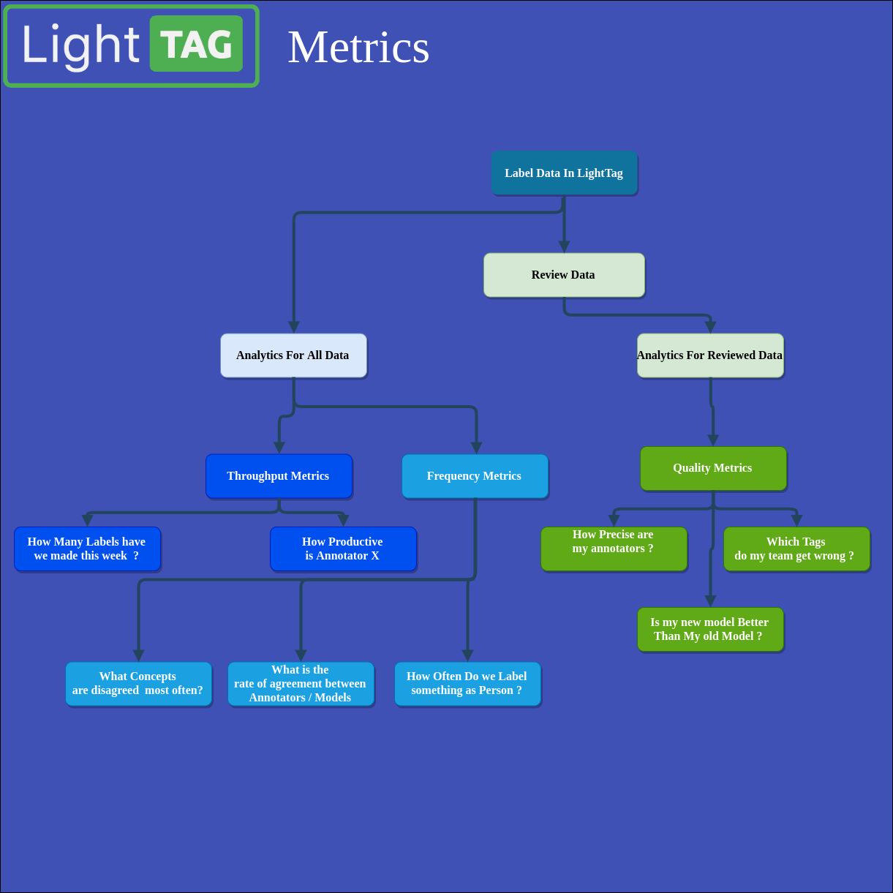

.. _analytics:
Review And Analytics
========================

.. toctree::
   :maxdepth: 1

   what_needs_review
   how_to_review
   review_access_controls
   throughput
   frequency 
   

Reviewing Annotations
During the course of an annotation project you'll want to know your project's throughput and your data's quality. 

Throughput is simple to measure, we simply count what was done.  You can get an estimate of data quality by measuring inter annotator agreement, 
however to know if your data is correct you need to know what the right answer is. LightTag's Review Mode solves that gap by giving you a 
simple and fast interface for reviewing labeled data. 

LightTag's analytics suite will show you Throughput, Agreement and Quality metrics and facilitates deep dive error analysis at the annotation level. 

In LightTag we speak about four types of analytics 

1. Throughput Metrics - These are metrics that cover how much work was done, such as how many annotations an annotator created. 
2. Frequency Metrics - 
   These are metrics that count how often something happened. For example how many times you labeled something is Person, or how often two labelers agreed with each other.
3. Quality Metrics- These are metrics that depend on a project manager reviewing the labeled data and saying what is right and what is wrong. These include Precision, Recall  and F1.
4. Data Instances - These are not metrics, but rather ways to look at phenomena in your data, such as "All Cases where an annotator made a False Negative"  

The Metrics and the kinds of questions they answer are shown in the following diagram: 

