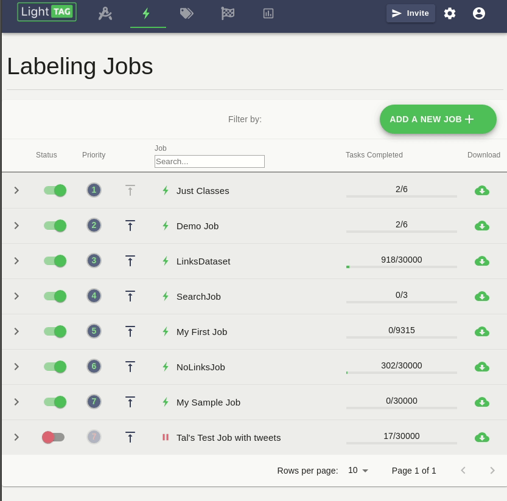
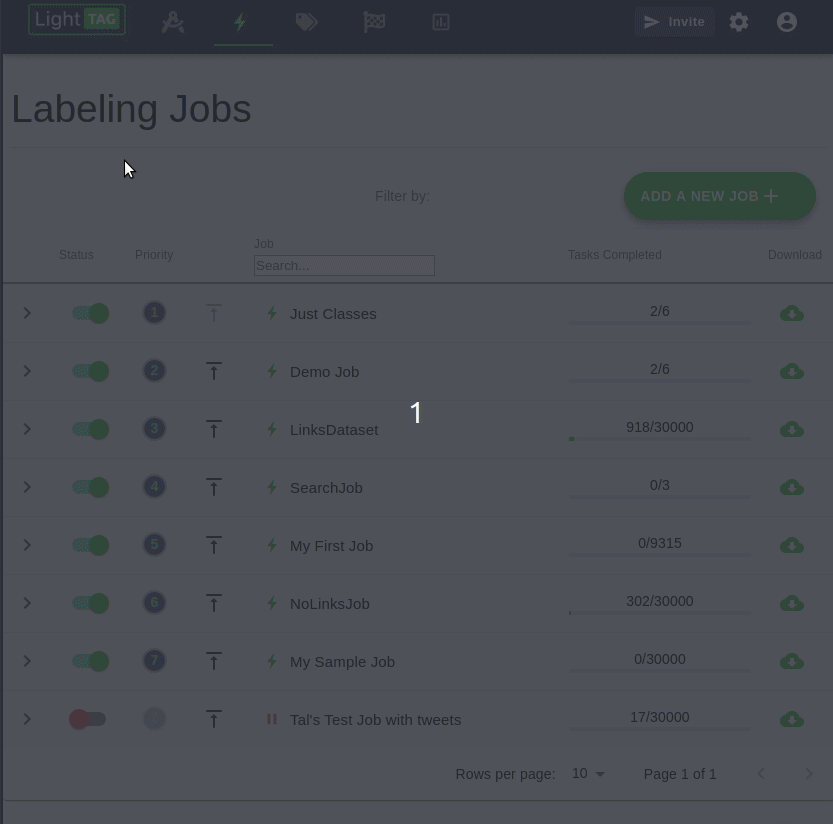

.. _review-Access-Controls:

Review Access Controls
======================

LightTag enables you to define who can review which dataset through two mechanism, roles and :ref:`teams <team>`.

Roles
-------

Managers And Reviewer
````````````````````````
LightTag has three roles, **Managers**, **Annotators** and **Reviewers**.

* **Annotators** can only annotate data
* **Managers** Can annotate, manage the entire project and review **any** dataset
* **Reviewers** Can annotate and review a dataset their team is assigned to

Assigning The Reviewer Role to a User in the UI
```````````````````````````````````````
To assign the user role to an annotator in the UI, go to settings, then annotators
and toggle the Reviewer role on the relevant user.



Reviewing Teams
----------------
Roles control who may review. Teams control **what** a reviewer can review.

Each :ref:`Dataset <dataset>` has a reviewing team assigned to it.
Only reviewers who are on that team may review that dataset.

A users permission to review a particular dataset is shown in the :ref:`pending review table <what-needs-review>` and is indicated
by an open or closed lock.

.. figure:: ./img/pending_review.png

Assigning A Reviewing Team to A Dataset in the UI
`````````````````````````````````````````````````
By default, the reviewing team for a Dataset is the Everyone team. That means that by default, any reviewer can review a dataset.
To change the reviewing team of a dataset
* Go to settings
* You'll be taken to the Datasets table
* Modify the reviewing team

