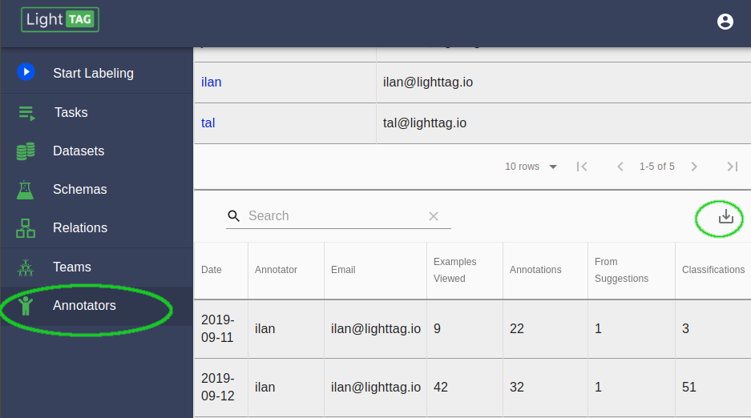

.. _throughput:

Throughput Metrics
===================

Annotator Throughput
---------------------

You'll typically want to know how much work each annotator on your team has done. 

This report is available in the annotators section, under the list of annotators. 
The report will show you, for each annotator 
* Every day they worked on the system
* How many examples they've seen 
* How many annotations they made 
* How many of those annotations were from a suggestion
* How many classifications they made 

The report is exportable as a csv 

   The Annotator Throughput Report

