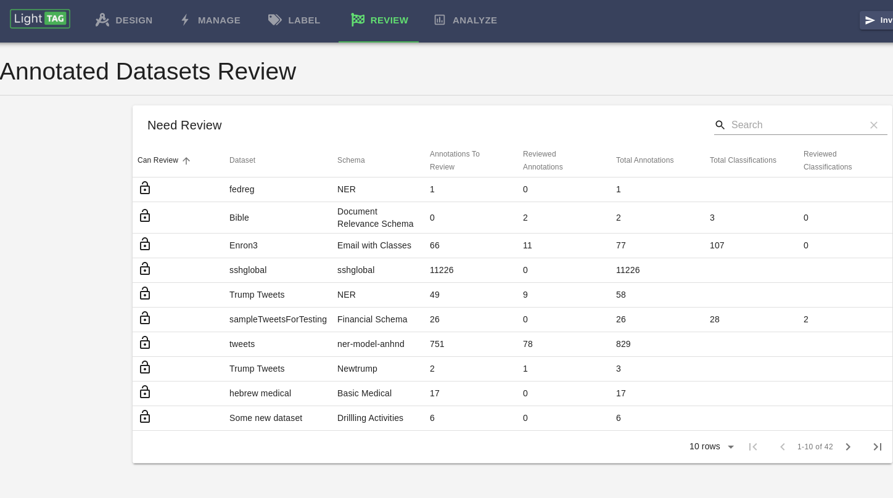

.. _what-needs-review:

The Pending Review List
=======================

The main review page will show you a list of the *things* that need to be reviewed.
Clicking on a row will take you to the :ref:`main review interface <how-to-review>`

The two core principle of Review in LightTag are

1.  There is only one right answer.
2.  There is no need to repeat yourself.

Therefore, the items to be reviewed are pairs of Datasets and Schemas, as opposed to a single job.
This allows you, the reviewer, to give the right answer only once even if a dataset was annotated by multiple models
or multiple jobs.

In LightTag, we can review Span Annotations (annotations) and Example Classifications.

The Pending Review table show's for each Dataset Schema pair, how many annotations and classifications were made, reviewed
and remain to be reviewed.

The first column in the table *Can Review* indicates whether you (the current user) have permissions to review the dataset.
Manager users can review any dataset and reviewers can be assigned to specific datasets. See the  :ref:`review-Access-Controls` section for more information on configuring access controls.
