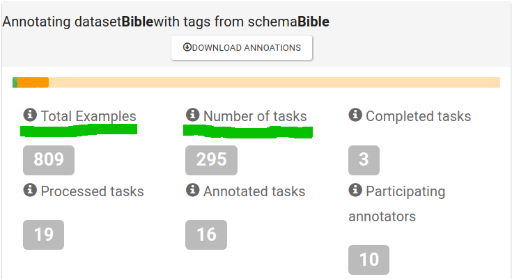

.. _exampleset:

Exampleset
==========
An Exampleset is a collection of :ref:`Examples<example>` that should be annotated together.

LightTags fundamental unit of work is the :ref:`task` which is the annotation of :ref:`examples<example>` in an Exampleset
with a :ref:`schema`
Examplesets are a concept internal to LightTag that are visible to the user in two places.

Examplesets during Annotation
-----------------------------
First, during the annotation project, if an aggregation key has been defined on the :ref:`dataset`, then the combined
examples are considered an Exampleset.

.. figure:: exampleset_annotation.png
  :scale: 100 %
  :alt: An exampleset with three examples
  :align: center

  An Exampleset with three examples

In the picture above, the annotator is shown three examples at the same time. The three examples together came from
  the same :ref:`dataset` and were grouped together because they share the same **Aggregation Key**.

Examplesets in Analytics
-----------------------------
The second place you'll encounter Examplesets is in the :ref:`analytics` sections. Since the annotator works through
Examplesets, you'll  want to measure progress in terms of Examplesets and not just in terms of Examples.

  The underlined metrics correspond to individual examples as well as "Tasks"/ which are the annotation of an Exampleset

In the image above, we can see that there are 809 Examples to be annotated, but they are broken down into 295 Tasks e.g.
Examplesets
