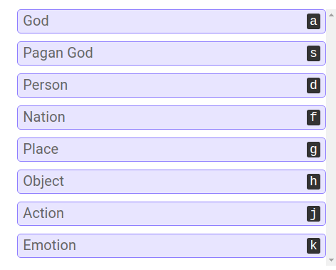
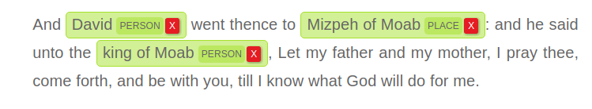

.. _tag:

Tag
===
In LightTag, a Tag is what the annotator applies to an Example to make an annotation. A Tag belongs to a :ref:`schema`.
You define them during the :ref:`onboarding process<first_schema>`

Here is a list of Tags from a Schema, as your annotator would see it

And here are some of those Tags applied to an :ref:`example`

